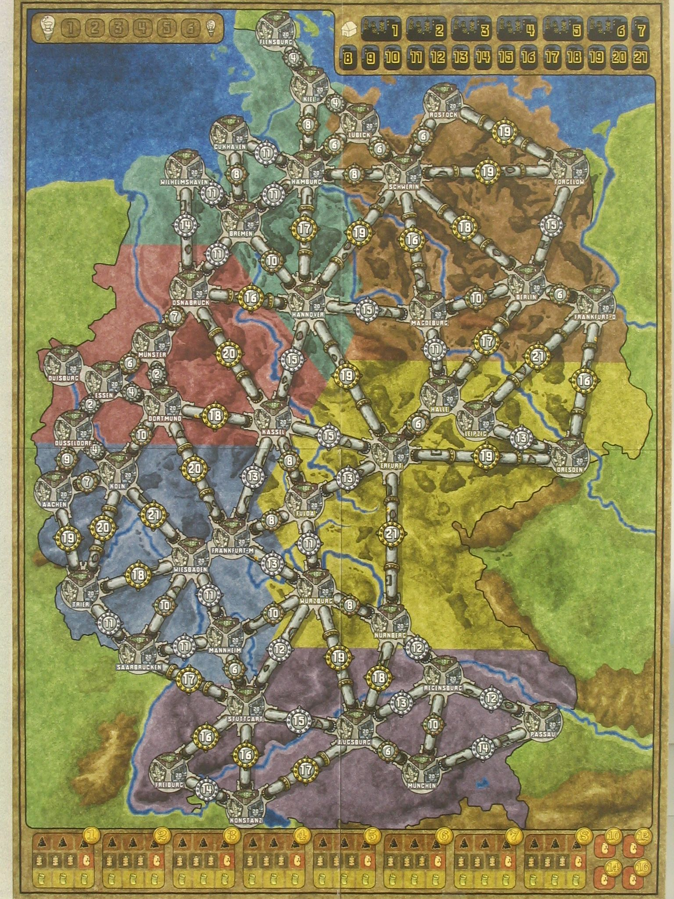

# PowerGrid

Concordia University 2019
### 
Advanced program design with C++ 

## Contributors:
* Rose Dufresne
* Elsa Donovan
* Deniz Akcal
* Isabelle Gourchette

## Gameplay

### To find Rule Book, Download here:
http://riograndegames.com/Game/1339-Power-Grid-recharged

## What I did (Rose)

### GraphBuilder.h and GraphBuilder.cpp

GraphBuilder is the base structure of the game. Without it, the game would have no game board, and hence no functional game (Imagine playing monopoly without the game board... What kind of game would that be). The GraphBuilder describes this map:

The Graph is built as an Adjacency List. This means that there is a vector of Cities (City Objects) where each city points towards a list of other cities that it is adjacent to, which, in a way, creates the edges between them. For example, from the Germany map displayed above, Flensburg would be the first city in the vector. Flensburg would point to the city Kiel and Kiel would also point towards the city Flensburg creating a two-way pointer that becomes an edge. 

This data structure used pointers extensively and is in my opinion a good example that displays pointers potential and logic. You will see that I built my class by taking into consideration pointers and their many traps (dangling pointers or wild pointers). To do this I made sure to use destructors and I used pointers to create connections between each node/city in the map. 

### City.h and City.cpp

Very simple class that will keep track of all the information related to a city. For example its name, color, availability and state. 

### Game.hpp and Game.cpp

This is where all of the game logic happens. More specifically, this is where each phase of the game occurs and the main game loop is implemented. The main methods that make the game come together are:

* void deckSetup();
* void setUpPlayers();
*	void setUpMap();
*	void phase1_determinePlayerOrder();
*	void phase2_auctionPowerPlants();
*	void phase3_buyingResources();
*	void phase4_building();
*	void phase5_bureaucracy();
(and of course ...)
* void play();

You could Ctrl+F the word "(Rose)" in the files to find which parts of the code I contributed to, but to put it short, I programmed setUpPlayers(), setUpMap(), phase2_auctionPowerPlants() and play(). To understand what each function does, in the ones listed above, expecially the ones related to "phases", I suggest you read the rule book that describes the game logic behind those functions in more detail. 

### Info.h, Observer.h, Stats.h and Subject.h

These are the functions used to implement the observer design pattern. 

#### Subject.h
Allows us to send a notification to all of the observers to update the state of the game and the player stats

#### Observer.h
Interface that will be used by children of this class to update and display the state of the game and the player stats.

#### Info.h
This is an observer that that will display the state of the game when notified. That is, Which game phase are we in and the status of each player (aka, how much resources, money and cities they have).

#### Stats.h
This is an observer that will visually represent the state of the game board (resources available, player city networks, powerplants available, etc).

